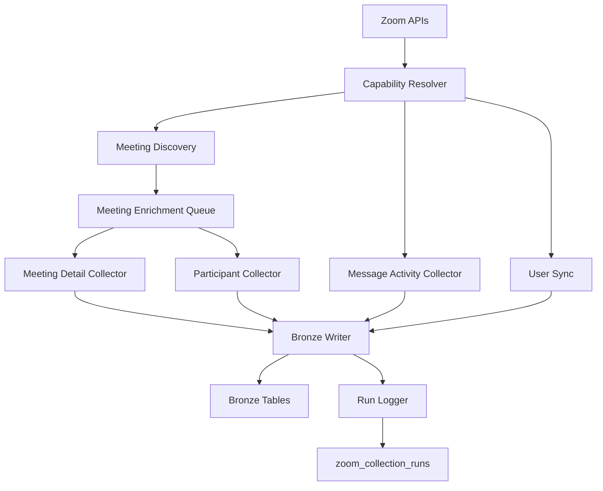
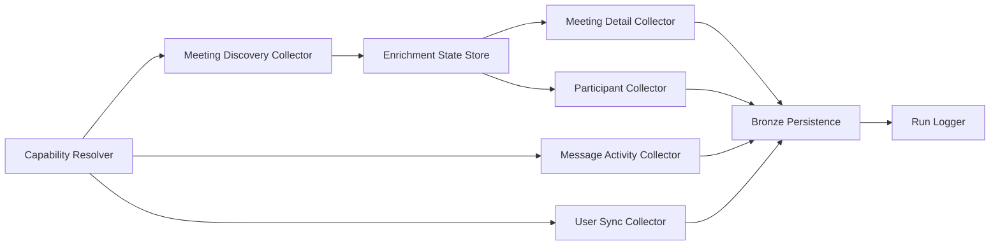
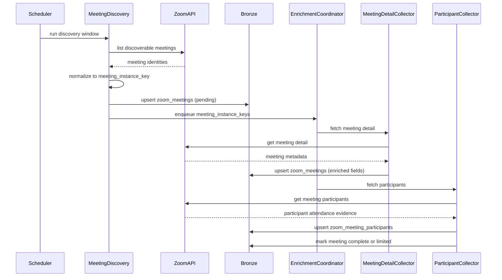
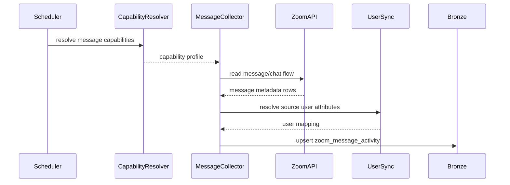

# Technical Design — Zoom Connector

<!-- toc -->

- [1. Architecture Overview](#1-architecture-overview)
  - [1.1 Architectural Vision](#11-architectural-vision)
  - [1.2 Architecture Drivers](#12-architecture-drivers)
  - [1.3 Architecture Layers](#13-architecture-layers)
- [2. Principles & Constraints](#2-principles--constraints)
  - [2.1 Design Principles](#21-design-principles)
  - [2.2 Constraints](#22-constraints)
- [3. Technical Architecture](#3-technical-architecture)
  - [3.1 Domain Model](#31-domain-model)
  - [3.2 Component Model](#32-component-model)
  - [3.3 API Contracts](#33-api-contracts)
  - [3.4 Internal Dependencies](#34-internal-dependencies)
  - [3.5 External Dependencies](#35-external-dependencies)
  - [3.6 Interactions & Sequences](#36-interactions--sequences)
  - [3.7 Database schemas & tables](#37-database-schemas--tables)
  - [3.8 Deployment Topology](#38-deployment-topology)
- [4. Additional context](#4-additional-context)
  - [Source Collection Strategy](#source-collection-strategy)
  - [Incremental Discovery Strategy](#incremental-discovery-strategy)
  - [Incremental Enrichment Strategy](#incremental-enrichment-strategy)
  - [Endpoint Usage Strategy](#endpoint-usage-strategy)
  - [Identity Model](#identity-model)
  - [Record Linkage Model](#record-linkage-model)
  - [Deduplication and Idempotence Approach](#deduplication-and-idempotence-approach)
  - [Retry, Replay, and Overlap-Window Behavior](#retry-replay-and-overlap-window-behavior)
  - [Run Logging and Observability Model](#run-logging-and-observability-model)
  - [Assumptions and Risks That Affect Implementation](#assumptions-and-risks-that-affect-implementation)
- [5. Traceability](#5-traceability)

<!-- /toc -->

- [ ] `p3` - **ID**: `cpt-insightspec-design-zoom-connector`
## 1. Architecture Overview

### 1.1 Architectural Vision

The Zoom connector uses a meeting-first Bronze design that preserves source-native meeting and participant evidence as the authoritative synchronous collaboration record, while handling message activity through a separate user-scoped chat flow. This design follows the current [PRD.md](./PRD.md) as the source of truth: meeting discovery and meeting enrichment are mandatory and meeting-scoped, participant attendance duration is a hard `p1` requirement, and message activity is mandatory but must not be forced into meeting enrichment unless Zoom exposes reliable meeting-level linkage.

The architecture separates discovery from enrichment so that newly visible meetings can be identified cheaply, queued for follow-up, and then enriched with detail and participant records through idempotent per-meeting work. Message activity follows a parallel but distinct path implemented through a separate user-scoped chat collection flow. The connector preserves the strongest supported linkage between entities and leaves unsupported relationships null rather than inventing source semantics.

Historical recovery is treated as best-effort onboarding or replay behavior, while ongoing incremental collection is mandatory. The design therefore centers on durable cursors, overlap-window replay, per-entity idempotence, and run logging that makes incomplete enrichment and source-capability limitations visible to operators.

### 1.2 Architecture Drivers

Requirements that significantly influence architecture decisions.

**ADRs**: Not applicable because no Zoom-specific ADR exists yet in [`ADR/`](./ADR/).

#### Functional Drivers

| Requirement | Design Response |
|-------------|------------------|
| `cpt-insightspec-fr-zoom-meeting-discovery` | Use a dedicated meeting discovery component that scans the configured incremental window, normalizes source identifiers into a canonical meeting instance identity, persists newly visible meetings, and records a discovery cursor separate from enrichment progress. |
| `cpt-insightspec-fr-zoom-meeting-enrichment` | Use a queued enrichment flow keyed by canonical meeting instance identity so every newly discovered meeting is followed by detail and participant collection. |
| `cpt-insightspec-fr-zoom-meeting-participants` | Store participant records per meeting with join and leave evidence, and derive participant duration from source-provided attendance timestamps when available. |
| `cpt-insightspec-fr-zoom-meeting-traceability` | Model meetings and participants as first-class Bronze entities; expose optional message linkage only when the source provides trustworthy association. |
| `cpt-insightspec-fr-zoom-message-activity` | Persist message activity as a dedicated Bronze entity independent from meeting enrichment. |
| `cpt-insightspec-fr-zoom-message-collection-strategy` | Implement message activity through a separate user-scoped chat flow that stays independent from meeting enrichment. |
| `cpt-insightspec-fr-zoom-message-linkage-scope` | Keep meeting-scoped enrichment separate from message collection; allow nullable meeting linkage in message records only when source semantics support it. |
| `cpt-insightspec-fr-zoom-message-content-exclusion` | Exclude message bodies from Bronze tables and retain only metadata needed for counting, attribution, timing, and optional linkage. |
| `cpt-insightspec-fr-zoom-incremental-collection` | Use persisted cursors and overlap windows for discovery, enrichment, and the separate message collection flow independently. |
| `cpt-insightspec-fr-zoom-historical-backfill` | Support bounded historical replay jobs that reuse the same collectors and idempotence keys as steady-state runs. |
| `cpt-insightspec-fr-zoom-collection-runs` | Emit a collection run record plus component-level counters and limitation metadata for every run. |
| `cpt-insightspec-fr-zoom-idempotence` | Define stable uniqueness keys for meetings, participants, users, messages, and run rows so replay is safe. |
| `cpt-insightspec-fr-zoom-user-identity-support` | Maintain a lightweight user directory table keyed by Zoom user ID and normalized email for attribution and downstream identity resolution. |

#### NFR Allocation

| NFR ID | NFR Summary | Allocated To | Design Response | Verification Approach |
|--------|-------------|--------------|-----------------|----------------------|
| `cpt-insightspec-nfr-zoom-freshness` | New meeting and message activity available within 24 hours | Scheduler, discovery cursoring, replay windows | Use frequent scheduled runs with bounded overlap windows and independent cursors for discovery and message collection. | Run log latency metrics and downstream Bronze freshness checks |
| `cpt-insightspec-nfr-zoom-enrichment-completeness` | 95% of discovered meetings fully enriched with detail and participants | Enrichment queue, meeting state model | Track enrichment status per meeting and retry incomplete meetings until success or explicit source limitation is recorded. | Meeting completeness counters and audit queries |
| `cpt-insightspec-nfr-zoom-operational-resilience` | Retries and overlaps must not create inconsistent counts | Idempotence keys, overlap window policy, replay-safe writes | Use deterministic unique keys and last-write-wins versioning for replayed windows. | Replay tests, duplicate detection queries, run comparison checks |

### 1.3 Architecture Layers

- [ ] `p3` - **ID**: `cpt-insightspec-tech-zoom-connector-layers`

| Layer | Responsibility | Technology |
|-------|---------------|------------|
| Source Integration | Call the configured Zoom endpoints and collect Zoom entities | Zoom REST APIs, OAuth 2.0 Server-to-Server app |
| Collection Orchestration | Manage cursors, overlap windows, queued enrichment, retries | Existing repository connector runtime and scheduled batch jobs |
| Domain Normalization | Normalize source records into meeting, participant, message, user, and run entities | Connector transformation layer |
| Persistence | Write idempotent Bronze rows and run state | Bronze storage used by repository connector specs |

## 2. Principles & Constraints

### 2.1 Design Principles

#### Meeting Evidence Is Authoritative

- [ ] `p2` - **ID**: `cpt-insightspec-principle-zoom-meeting-evidence-authoritative`

Meeting-level and participant-level records are the authoritative synchronous collaboration evidence for Zoom. Daily summaries may be derived later, but the connector design centers on preserving source-native meeting identities and attendance evidence first.

**ADRs**: Not applicable because no Zoom-specific ADR exists yet.

#### Strongest Supported Linkage Only

- [ ] `p2` - **ID**: `cpt-insightspec-principle-zoom-strongest-supported-linkage`

The connector preserves the strongest source-supported relationship between records and leaves unsupported relationships null. It does not infer message-to-meeting linkage, organizer semantics, or user mappings that Zoom does not explicitly provide.

**ADRs**: Not applicable because no Zoom-specific ADR exists yet.

#### Canonical Meeting Instance Identity

- [ ] `p2` - **ID**: `cpt-insightspec-principle-zoom-canonical-meeting-instance-identity`

Every persisted meeting-scoped record uses a non-null canonical `meeting_instance_key` derived from the strongest source-supported concrete meeting identity available for that record. Source identifiers such as series ID, occurrence ID, and UUID are preserved separately so the connector stays source-faithful while avoiding nullable fields in authoritative primary keys.

**ADRs**: Not applicable because no Zoom-specific ADR exists yet.

#### Separate Async and Sync Flows

- [ ] `p2` - **ID**: `cpt-insightspec-principle-zoom-separate-async-sync-flows`

Meeting enrichment and message collection are distinct flows with separate cursors, retries, and observability. This keeps mandatory message collection from being blocked by meeting-only APIs and avoids forcing unsupported coupling between synchronous and asynchronous data.

**ADRs**: Not applicable because no Zoom-specific ADR exists yet.

#### Replay Must Be Safe

- [ ] `p2` - **ID**: `cpt-insightspec-principle-zoom-replay-safe`

Incremental windows, retries, and historical replay must be safe to rerun. The connector therefore uses deterministic identity keys and replay-tolerant writes for all persisted entities.

**ADRs**: Not applicable because no Zoom-specific ADR exists yet.

### 2.2 Constraints

#### Zoom Capability Variability

- [ ] `p2` - **ID**: `cpt-insightspec-constraint-zoom-capability-variability`

Zoom message activity support, meeting detail visibility, and linkage quality may vary by account plan, enabled products, endpoint availability, and permissions. The design must branch by detected source capability instead of assuming a uniform API surface.

**ADRs**: Not applicable because no Zoom-specific ADR exists yet.

#### Best-Effort Historical Recovery

- [ ] `p2` - **ID**: `cpt-insightspec-constraint-zoom-best-effort-history`

Historical backfill is useful but not guaranteed. The design must allow recovery jobs without making deep historical completeness a hard architectural dependency.

**ADRs**: Not applicable because no Zoom-specific ADR exists yet.

#### No Message Content Persistence

- [ ] `p2` - **ID**: `cpt-insightspec-constraint-zoom-no-message-content`

The connector may inspect message metadata needed for metrics, but it must not persist message bodies. This limits privacy exposure and constrains the Bronze model for async activity.

**ADRs**: Not applicable because no Zoom-specific ADR exists yet.

## 3. Technical Architecture

### 3.1 Domain Model

**Technology**: Connector-owned Bronze tables and normalized source records

**Location**: [PRD.md](./PRD.md)

**Core Entities**:

| Entity | Description | Schema |
|--------|-------------|--------|
| ZoomMeeting | Meeting discovered from Zoom and enriched with meeting-level metadata | [DESIGN.md](./DESIGN.md) |
| ZoomMeetingParticipant | Participant attendance evidence for a specific meeting | [DESIGN.md](./DESIGN.md) |
| ZoomMessageActivity | User-attributed async message activity collected from a separate user-scoped chat flow | [DESIGN.md](./DESIGN.md) |
| ZoomUser | Lightweight user directory record used for attribution and identity resolution | [DESIGN.md](./DESIGN.md) |
| ZoomCollectionRun | Run-level observability record with component counters and limitation metadata | [DESIGN.md](./DESIGN.md) |

**Relationships**:
- ZoomMeeting → ZoomMeetingParticipant: one-to-many by `meeting_instance_key`
- ZoomUser → ZoomMeetingParticipant: one-to-many by source user identity when present
- ZoomUser → ZoomMessageActivity: one-to-many by source user identity
- ZoomMeeting → ZoomMessageActivity: optional one-to-many by nullable `linked_meeting_instance_key` only when Zoom exposes reliable linkage
- ZoomCollectionRun → all entities: one-to-many by `run_id` for observability, not business identity

**Meeting identity model**:
- `meeting_series_id`: stable source identifier for the logical Zoom meeting series or parent meeting definition when available
- `meeting_occurrence_id`: source occurrence identifier for a concrete recurring instance when available
- `meeting_uuid`: source UUID for a concrete realized meeting instance when available
- `meeting_instance_key`: authoritative non-null Bronze identity for one concrete persisted meeting instance

**Canonical normalization rules**:
1. If Zoom provides a concrete realized meeting UUID for the record, normalize `meeting_instance_key = "zoom:uuid:" + normalized(meeting_uuid)`.
2. Else if Zoom provides a concrete occurrence identifier, normalize `meeting_instance_key = "zoom:occurrence:" + normalized(meeting_series_id) + ":" + normalized(meeting_occurrence_id)`.
3. Else normalize `meeting_instance_key = "zoom:series-window:" + normalized(meeting_series_id) + ":" + normalized(actual_start_at_or_scheduled_start_at)` using the strongest available source timestamp.
4. If rule 3 is used, mark `identity_strength = "fallback"` and preserve all raw source identifiers so downstream systems know the identity is weaker than UUID- or occurrence-backed identity.

**Core invariants**:
- A meeting may exist in Bronze before enrichment is complete, but it must carry an enrichment status
- A participant row must reference exactly one persisted meeting row
- A persisted meeting row always has a non-null `meeting_instance_key`
- Participant duration is derived only from source-provided attendance evidence; it is never inferred from meeting totals
- A message activity row may be unrelated to any specific meeting and must not be forcibly linked
- A user record supports identity and attribution only; it is not treated as authoritative workforce directory state

### 3.2 Component Model

#### Capability Resolver

- [ ] `p2` - **ID**: `cpt-insightspec-component-zoom-capability-resolver`

##### Why this component exists

The connector needs a single place to interpret which Zoom endpoints and linkage semantics are actually available for the configured tenant.

##### Responsibility scope

- Resolve whether meeting discovery, meeting detail, participant detail, and the configured separate chat flow are available
- Publish a capability profile used by downstream collectors

##### Responsibility boundaries

- Does not persist business entities
- Does not invent availability based on product assumptions; it records only configured or detected capability

##### Related components (by ID)

- `cpt-insightspec-component-zoom-meeting-discovery` — enables meeting discovery strategy
- `cpt-insightspec-component-zoom-message-collector` — validates separate message flow availability

#### Meeting Discovery Collector

- [ ] `p2` - **ID**: `cpt-insightspec-component-zoom-meeting-discovery`

##### Why this component exists

Discovery isolates the cheap incremental scan for newly visible meetings from the heavier per-meeting enrichment work.

##### Responsibility scope

- Scan the configured discovery window
- Normalize source `id`, `uuid`, and `occurrence_id` values into `meeting_instance_key`
- Persist newly discovered meetings with discovery metadata and enrichment status `pending`
- Advance the meeting discovery cursor only after the discovery window is durably persisted

##### Responsibility boundaries

- Does not collect participant data
- Does not require message linkage

##### Related components (by ID)

- `cpt-insightspec-component-zoom-enrichment-coordinator` — hands off meetings for enrichment
- `cpt-insightspec-component-zoom-bronze-persistence` — writes meeting rows

#### Enrichment Coordinator

- [ ] `p2` - **ID**: `cpt-insightspec-component-zoom-enrichment-coordinator`

##### Why this component exists

Every newly discovered meeting must be enriched, retried when incomplete, and marked with explicit limitation reasons when Zoom does not provide required evidence.

##### Responsibility scope

- Queue pending meetings for detail and participant collection
- Track `pending`, `in_progress`, `complete`, and `limited` enrichment states
- Apply retry and overlap policies

##### Responsibility boundaries

- Does not collect messages except for optional meeting-linked message references when supported
- Does not derive participant duration beyond storing source evidence

##### Related components (by ID)

- `cpt-insightspec-component-zoom-meeting-detail` — collects meeting metadata
- `cpt-insightspec-component-zoom-participant-collector` — collects attendance evidence

#### Meeting Detail Collector

- [ ] `p2` - **ID**: `cpt-insightspec-component-zoom-meeting-detail`

##### Why this component exists

Meeting discovery typically does not return enough data to satisfy the PRD’s meeting-scoped analysis needs.

##### Responsibility scope

- Read per-meeting detail for discovered meetings
- Normalize organizer, schedule, timing, meeting classification, and any stronger meeting identifiers revealed by detail endpoints

##### Responsibility boundaries

- Does not infer organizer or meeting type fields beyond explicit source values
- Does not manage retries itself

##### Related components (by ID)

- `cpt-insightspec-component-zoom-enrichment-coordinator` — requests work
- `cpt-insightspec-component-zoom-bronze-persistence` — writes meeting updates

#### Participant Collector

- [ ] `p2` - **ID**: `cpt-insightspec-component-zoom-participant-collector`

##### Why this component exists

Participant attendance duration is a hard `p1` requirement and therefore needs a dedicated, replay-safe collector.

##### Responsibility scope

- Collect participant rows for a discovered meeting
- Reference the parent meeting only through `meeting_instance_key`
- Persist join and leave evidence and derived duration fields when supported
- Mark meetings as `limited` when participant data is unavailable or incomplete due to source capability

##### Responsibility boundaries

- Does not infer duration from daily summaries
- Does not aggregate participants into daily rollups inside Bronze

##### Related components (by ID)

- `cpt-insightspec-component-zoom-enrichment-coordinator` — schedules participant collection
- `cpt-insightspec-component-zoom-bronze-persistence` — writes participant rows

#### Message Activity Collector

- [ ] `p2` - **ID**: `cpt-insightspec-component-zoom-message-collector`

##### Why this component exists

Message activity is mandatory, but it is implemented as a dedicated separate flow with its own endpoint behavior and linkage semantics.

##### Responsibility scope

- Collect message activity through the implemented separate user-scoped chat flow
- Persist optional `linked_meeting_instance_key` only when the source exposes reliable linkage that can be normalized into the canonical meeting identity

##### Responsibility boundaries

- Does not force message rows into meeting enrichment
- Does not persist message body content

##### Related components (by ID)

- `cpt-insightspec-component-zoom-capability-resolver` — supplies capability profile
- `cpt-insightspec-component-zoom-user-sync` — supports user attribution
- `cpt-insightspec-component-zoom-bronze-persistence` — writes message rows

#### User Sync Collector

- [ ] `p2` - **ID**: `cpt-insightspec-component-zoom-user-sync`

##### Why this component exists

Meetings, participants, and messages need a consistent source-user reference for attribution and downstream identity resolution.

##### Responsibility scope

- Sync lightweight Zoom user records
- Normalize email and source identifiers
- Preserve source status and display attributes useful for attribution

##### Responsibility boundaries

- Does not expand into full directory management
- Does not own cross-source identity matching

##### Related components (by ID)

- `cpt-insightspec-component-zoom-message-collector` — uses user mappings
- `cpt-insightspec-component-zoom-bronze-persistence` — writes user rows

#### Bronze Persistence and Run Logger

- [ ] `p2` - **ID**: `cpt-insightspec-component-zoom-bronze-persistence`

##### Why this component exists

All collectors need a single replay-safe write path and a consistent observability model.

##### Responsibility scope

- Apply idempotent writes for all Bronze entities
- Attach run metadata, source endpoint metadata, and limitation codes
- Write run-level counters and completion status

##### Responsibility boundaries

- Does not decide source collection strategy
- Does not perform downstream Silver transformations

##### Related components (by ID)

- `cpt-insightspec-component-zoom-meeting-discovery` — writes discovered meetings
- `cpt-insightspec-component-zoom-participant-collector` — writes participants
- `cpt-insightspec-component-zoom-message-collector` — writes messages
- `cpt-insightspec-component-zoom-user-sync` — writes users

### 3.3 API Contracts

This connector exposes no public repository-facing API contract. Internal collector contracts are implementation details of the connector runtime.

- [ ] `p2` - **ID**: `cpt-insightspec-interface-zoom-connector-runtime`

- **Contracts**: None as public machine-readable contracts in current scope
- **Technology**: Internal scheduled connector execution
- **Location**: Not applicable because this design defines an internal connector, not a public service API

**Endpoints Overview**:

| Method | Path | Description | Stability |
|--------|------|-------------|-----------|
| N/A | N/A | Not applicable because the Zoom connector does not expose a public API in current scope | stable |

### 3.4 Internal Dependencies

| Dependency Module | Interface Used | Purpose |
|-------------------|----------------|----------|
| Bronze ingestion runtime | Connector writer interface | Persist normalized Zoom entities and run logs |
| Scheduler and job runner | Scheduled batch execution | Trigger recurring discovery, enrichment, message, and replay jobs |
| Identity Manager pipeline | Bronze-to-Silver identity resolution contract | Resolve normalized email and user identifiers to canonical people downstream |

**Dependency Rules** (per project conventions):
- No circular dependencies
- Always use repository connector runtime abstractions for persistence and scheduling
- The Zoom connector owns source collection only; downstream identity and analytics remain separate responsibilities

### 3.5 External Dependencies

#### Zoom APIs

| Dependency Module | Interface Used | Purpose |
|-------------------|---------------|---------|
| Zoom account integration | Server-to-Server OAuth authenticated REST APIs | Provide meetings, participants, user directory data, and message activity through the configured endpoint set |

**Dependency Rules** (per project conventions):
- Only the Zoom connector integration talks to Zoom directly
- Endpoint usage must respect capability detection rather than static assumptions
- Unsupported or unavailable fields must remain null with explicit limitation metadata

### 3.6 Interactions & Sequences

#### Meeting Discovery and Enrichment

**ID**: `cpt-insightspec-seq-zoom-meeting-enrichment`

**Use cases**: `cpt-insightspec-usecase-zoom-collect-meetings`

**Actors**: `cpt-insightspec-actor-zoom-operator`, `cpt-insightspec-actor-zoom-api`

**Description**: Discovery identifies newly visible meetings and persists them immediately. Enrichment then collects detail and participant evidence in a replay-safe way until each meeting is complete or explicitly limited by source capability.

#### Message Activity Collection

**ID**: `cpt-insightspec-seq-zoom-message-collection`

**Use cases**: `cpt-insightspec-usecase-zoom-collect-messages`

**Actors**: `cpt-insightspec-actor-zoom-analyst`, `cpt-insightspec-actor-zoom-api`

**Description**: Message activity is collected independently from meeting enrichment. The current implementation reads a separate user-scoped chat flow and persists optional meeting linkage only when Zoom provides trustworthy association in that payload.

### 3.7 Database schemas & tables

- [ ] `p3` - **ID**: `cpt-insightspec-db-zoom-bronze-model`

#### Table: `zoom_meetings`

**ID**: `cpt-insightspec-dbtable-zoom-meetings`

**Schema**:

| Column | Type | Description |
|--------|------|-------------|
| `meeting_instance_key` | String | Canonical non-null Bronze identity for the concrete meeting instance |
| `meeting_series_id` | String | Source-native logical meeting or series identifier |
| `meeting_occurrence_id` | String | Source occurrence identifier for a concrete recurring instance when available |
| `meeting_uuid` | String | Source UUID for a concrete realized meeting instance when available |
| `identity_strength` | String | `uuid`, `occurrence`, or `fallback` depending on normalization quality |
| `host_user_id` | String | Source-native host identifier when provided |
| `topic` | String | Meeting topic or title |
| `meeting_type` | String | Source-provided meeting classification |
| `scheduled_start_at` | DateTime | Scheduled start time when provided |
| `actual_start_at` | DateTime | Actual start time when provided |
| `actual_end_at` | DateTime | Actual end time when provided |
| `duration_seconds` | Int | Meeting duration in seconds when derivable from source evidence |
| `discovered_at` | DateTime | Timestamp when the connector first discovered the meeting |
| `enrichment_status` | String | `pending`, `in_progress`, `complete`, `limited` |
| `limitation_code` | String | Explicit source-side limitation when not fully enriched |
| `source_endpoint` | String | Endpoint or flow that produced the row |
| `run_id` | String | Collection run identifier |
| `data_source` | String | Always `insight_zoom` |
| `_version` | Int | Replay-safe version marker |
| `metadata` | String (JSON) | Raw source payload or normalized metadata |

**PK**: `meeting_instance_key`

**Constraints**: `meeting_instance_key` required; `meeting_series_id` required when available from source; `meeting_occurrence_id` and `meeting_uuid` may be null depending on endpoint capability

**Additional info**: Primary authoritative meeting table for all synchronous Zoom data. `meeting_instance_key` is always derived from the strongest available source identifier and never contains nullable components.

#### Table: `zoom_meeting_participants`

**ID**: `cpt-insightspec-dbtable-zoom-meeting-participants`

**Schema**:

| Column | Type | Description |
|--------|------|-------------|
| `meeting_instance_key` | String | Canonical parent meeting instance identity |
| `participant_key` | String | Stable participant key from user id, email, or source participant id |
| `zoom_user_id` | String | Source-native user id when known |
| `email` | String | Participant email when known |
| `display_name` | String | Participant display name from source |
| `join_at` | DateTime | Join timestamp |
| `leave_at` | DateTime | Leave timestamp |
| `attendance_duration_seconds` | Int | Derived from source attendance evidence |
| `attendance_status` | String | `present`, `partial`, `unknown` |
| `run_id` | String | Collection run identifier |
| `data_source` | String | Always `insight_zoom` |
| `_version` | Int | Replay-safe version marker |
| `metadata` | String (JSON) | Raw participant payload |

**PK**: `meeting_instance_key`, `participant_key`, `join_at`

**Constraints**: Parent meeting must exist by `meeting_instance_key`; duration derived only from explicit attendance evidence

**Additional info**: This table satisfies the hard `p1` participant duration requirement and is the only authoritative source for participant attendance duration

#### Table: `zoom_message_activity`

**ID**: `cpt-insightspec-dbtable-zoom-message-activity`

**Schema**:

| Column | Type | Description |
|--------|------|-------------|
| `message_activity_id` | String | Stable unique identifier from direct event id, aggregate key, or derived source key |
| `zoom_user_id` | String | Source-native user id when known |
| `email` | String | User email when known |
| `activity_date` | DateTime | Activity timestamp or aggregation date |
| `channel_type` | String | Source-supported message surface classification |
| `message_count` | Int | Count represented by this row |
| `aggregation_level` | String | `event`, `conversation_day`, `user_day`, or other source-supported grain |
| `collection_mode` | String | Always `separate_chat_flow` in the current implementation |
| `linked_meeting_instance_key` | String | Nullable canonical meeting link only when provided reliably by source |
| `linked_meeting_series_id` | String | Nullable source series identifier preserved for traceability |
| `linked_meeting_occurrence_id` | String | Nullable source occurrence identifier preserved for traceability |
| `linked_meeting_uuid` | String | Nullable source meeting UUID preserved for traceability |
| `source_endpoint` | String | Endpoint or flow used to collect this row |
| `run_id` | String | Collection run identifier |
| `data_source` | String | Always `insight_zoom` |
| `_version` | Int | Replay-safe version marker |
| `metadata` | String (JSON) | Raw message metadata without content |

**PK**: `message_activity_id`

**Constraints**: Message body content must not be persisted; `linked_meeting_instance_key` may be null

**Additional info**: Stores async activity collected from the connector's separate message flow while preserving linkage quality

#### Table: `zoom_users`

**ID**: `cpt-insightspec-dbtable-zoom-users`

**Schema**:

| Column | Type | Description |
|--------|------|-------------|
| `zoom_user_id` | String | Source-native user identifier |
| `email` | String | Normalized email for identity resolution |
| `display_name` | String | Display name |
| `first_name` | String | First name |
| `last_name` | String | Last name |
| `status` | String | Source account status |
| `user_type` | Int | Zoom account type when provided |
| `timezone` | String | User timezone |
| `collected_at` | DateTime | Sync timestamp |
| `run_id` | String | Collection run identifier |
| `data_source` | String | Always `insight_zoom` |
| `_version` | Int | Replay-safe version marker |
| `metadata` | String (JSON) | Raw user payload |

**PK**: `zoom_user_id`

**Constraints**: Email may be null for some source users; identity resolution must tolerate partial user profiles

**Additional info**: Support-only directory table for attribution and downstream person matching

#### Table: `zoom_collection_runs`

**ID**: `cpt-insightspec-dbtable-zoom-collection-runs`

**Schema**:

| Column | Type | Description |
|--------|------|-------------|
| `run_id` | String | Unique run identifier |
| `started_at` | DateTime | Run start timestamp |
| `completed_at` | DateTime | Run end timestamp |
| `status` | String | `running`, `completed`, `completed_with_limitations`, `failed` |
| `run_type` | String | `scheduled_incremental`, `replay`, `backfill`, `manual_repair` |
| `discovery_window_start` | DateTime | Meeting discovery window start |
| `discovery_window_end` | DateTime | Meeting discovery window end |
| `message_window_start` | DateTime | Message collection window start |
| `message_window_end` | DateTime | Message collection window end |
| `meetings_discovered` | Int | Newly discovered meetings |
| `meetings_enriched` | Int | Meetings completed in this run |
| `meetings_limited` | Int | Meetings limited by source capability |
| `participants_collected` | Int | Participant rows written |
| `messages_collected` | Int | Message activity rows written |
| `users_collected` | Int | User rows written |
| `retries_triggered` | Int | Retried enrichment or message work |
| `api_calls` | Int | Total source calls |
| `errors` | Int | Error count |
| `limitation_summary` | String (JSON) | Aggregated source-capability limitations |
| `settings` | String (JSON) | Effective run configuration |
| `data_source` | String | Always `insight_zoom` |
| `_version` | Int | Replay-safe version marker |

**PK**: `run_id`

**Constraints**: Monitoring table only; not used as business activity source

**Additional info**: Primary observability artifact for freshness, completeness, and limitation reporting

### 3.8 Deployment Topology

Not applicable because this design covers a repository connector run inside the existing batch ingestion environment rather than a separately deployed Zoom-specific service.

- [ ] `p3` - **ID**: `cpt-insightspec-topology-zoom-batch-runtime`

## 4. Additional context

### Source Collection Strategy

The connector uses three independent but coordinated source collection strategies:

1. Meeting discovery scans the configured incremental window for newly visible meetings and persists them immediately.
2. Meeting enrichment reads per-meeting detail and participant attendance evidence for every discovered meeting until complete or explicitly limited.
3. Message activity collection runs through a separate user-scoped chat flow and remains operationally independent from meeting enrichment.

This keeps the implementation practical and aligned with the approved scope without allowing message requirements to disappear.

### Incremental Discovery Strategy

Meeting discovery maintains its own durable cursor and always reads an overlap window behind the last successful watermark. Newly discovered meetings are identified by `meeting_instance_key` and inserted or updated idempotently. A meeting is considered newly discovered when its canonical `meeting_instance_key` has not yet been persisted, regardless of whether the same time range has been scanned before.

### Incremental Enrichment Strategy

Enrichment is state-driven rather than purely window-driven. Every newly discovered meeting enters `pending`. The coordinator repeatedly retries pending or limited meetings inside a bounded replay window until:
- detail and participant evidence are fully collected,
- or the source explicitly lacks the required participant visibility,
- or the meeting ages out of the replay policy and remains marked `limited`.

This keeps ongoing incremental collection mandatory without blocking the pipeline on a single failing meeting.

### Endpoint Usage Strategy

The current implementation uses the following Zoom API contract:
- `GET /users` for user directory support and message-flow partitioning
- `GET /metrics/meetings` for meeting discovery, using `page_size` and `next_page_token` pagination
- `GET /metrics/meetings/{meeting_uuid}/participants` for meeting-scoped participant attendance evidence, with encoded meeting UUID, tolerant handling for source-side `404` gaps, and `page_size` plus `next_page_token` pagination
- `GET /chat/users/{zoom_user_id}/messages` for separate user-scoped message activity collection

The declarative source manifest names the corresponding source streams `users`, `meetings`, `participants`, and `message_activities`. These stream names are implementation identifiers only; Bronze persistence remains `zoom_users`, `zoom_meetings`, `zoom_meeting_participants`, and `zoom_message_activity`.

Server-to-Server OAuth token acquisition uses `account_id`, `client_id`, and `client_secret`. The design still records source limitations when any endpoint does not expose complete data, but it does not model multiple interchangeable message collection strategies in the current implementation. It never creates synthetic meeting-message joins to compensate.

### Identity Model

The primary source identity keys are `zoom_user_id` and normalized `email` for people, plus a normalized meeting identity stack for synchronous activity. `zoom_user_id` is authoritative for Zoom-local attribution. `email` is the preferred downstream cross-source identity anchor when present. For meetings, the connector preserves `meeting_series_id`, `meeting_occurrence_id`, and `meeting_uuid` separately, then derives a non-null canonical `meeting_instance_key` from the strongest available concrete identifier. Participant and message rows may contain only partial source identity depending on payload quality, so the design preserves all available identifiers independently and does not require perfect user directory coverage for writes to succeed.

### Record Linkage Model

Record linkage is explicit and asymmetric:
- meetings link strongly to participants through required `meeting_instance_key` foreign keys
- users link strongly to meetings, participants, and messages when source identifiers are present
- messages link weakly to meetings through optional nullable `linked_meeting_instance_key`

This model preserves the strongest available linkage while preventing unsupported semantics from entering Bronze.

### Deduplication and Idempotence Approach

All entity writes are upserts keyed by deterministic primary identity:
- meetings by `meeting_instance_key`
- participants by `(meeting_instance_key, participant_key, join_at)`
- messages by `message_activity_id`
- users by `zoom_user_id`
- runs by `run_id`

`_version` stores a monotonically increasing replay marker such as collection timestamp or source freshness marker. Replayed rows overwrite older versions for the same identity key. This supports overlap windows, retries, and manual repair runs without duplicate growth.

Meeting identity normalization is deterministic:
- prefer `meeting_uuid` when available because it most directly identifies a realized meeting instance
- else prefer `(meeting_series_id, meeting_occurrence_id)` when occurrence identity is present
- else derive `meeting_instance_key` from `meeting_series_id` plus strongest available source timestamp

Fallback-derived keys are allowed only when stronger identifiers are unavailable from the source endpoint. When fallback is used, `identity_strength = "fallback"` must be persisted so downstream consumers understand that identity quality is weaker and cross-endpoint reconciliation may require care.

### Retry, Replay, and Overlap-Window Behavior

Scheduled incremental runs use a short overlap window for meetings and messages to catch late-arriving or delayed source visibility. Replay and backfill runs reuse the same collectors and keys but widen the requested windows. Partial failures do not roll back successful entity writes; instead they leave targeted entities eligible for retry and mark the run `completed_with_limitations` or `failed` based on configured thresholds.

### Run Logging and Observability Model

Observability is built around `zoom_collection_runs` plus per-row run attribution. Each run captures:
- independent windows for meetings and messages
- counters for discovered, enriched, limited, and retried entities
- error counts and limitation summaries
- effective capability profile and source endpoint usage

This gives operators direct visibility into whether low message counts are caused by low activity, source capability gaps, or collection failures.

### Assumptions and Risks That Affect Implementation

- Assumption: the repository’s existing Bronze ingestion runtime can support replay-safe upsert semantics and run attribution for connector rows.
- Assumption: source payloads provide enough participant timing evidence to calculate attendance duration for most eligible meetings.
- Assumption: message activity may arrive at a different grain than meetings and should still be preserved.
- Assumption: the current connector implementation authenticates through Zoom Server-to-Server OAuth using `account_id`, `client_id`, and `client_secret`.
- Assumption: Zoom endpoints may expose `id`, `uuid`, and `occurrence_id` inconsistently, but at least one stable concrete meeting identity path is available for most collected meetings.
- Risk: the separate user-scoped message flow may be expensive or incomplete for some tenants, increasing API cost and runtime.
- Risk: different endpoints may surface different meeting identifier forms for the same real-world meeting instance, making canonical normalization and reconciliation critical to avoid split identity.
- Risk: recurring meetings may require careful handling of occurrence identity to avoid merging separate meeting instances.
- Risk: participant payload quality may differ across meeting types, making completeness highly dependent on source capabilities.

## 5. Traceability

- **PRD**: [PRD.md](./PRD.md)
- **ADRs**: [ADR/](./ADR/)
- **Features**: Not applicable because feature-level specs do not exist yet for the Zoom connector
